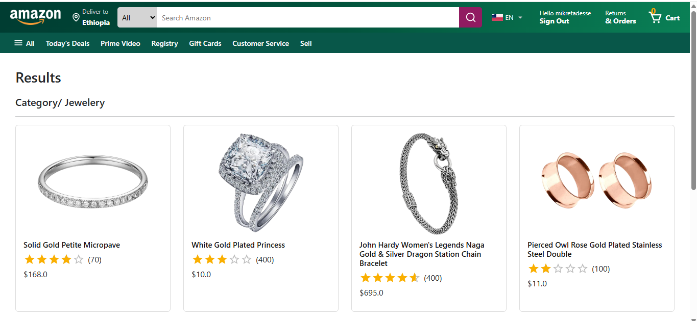
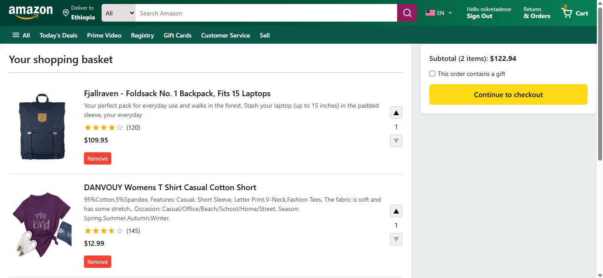
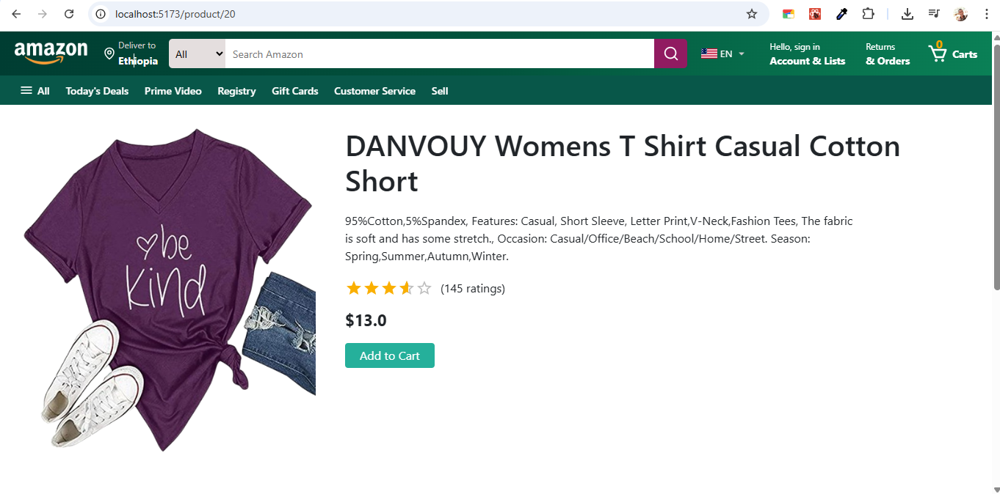

# Amazon Clone

  
  
  

An Amazon-like e-commerce web application built with React, Vite, Firebase, Stripe, and Node.js. This project allows users to browse products, add items to a shopping cart, sign up/sign in, simulate payments, and see order lists.

## 🌐 Demo

- Frontend live: [https://amazon-clone.mikretadesse.com](https://amazon-clone.mikretadesse.com)
- Backend live (Render): [https://mikre-amazon-clone-2025-backend.onrender.com](https://mikre-amazon-clone-2025-backend.onrender.com)

---

## ✨ Features

- User authentication with **Firebase Auth** (Email/Password)
- **Email verification** for new accounts
- Browse products with images, descriptions, and prices
- Add/remove items in the shopping cart
- Checkout using **Stripe API** (simulated payments)
- Responsive design for mobile and desktop
- Backend API powered by **Node.js + Express** (or Firebase Functions)

---

## 🛠 Tech Stack

| Layer           | Technology                             |
| --------------- | -------------------------------------- |
| Frontend        | React, Vite, CSS Modules, JavaScript   |
| Backend         | Node.js, Express                       |
| Database & Auth | Firebase Firestore, Firebase Auth      |
| Payments        | Stripe API                             |
| Hosting         | Frontend: Yegara Host, Backend: Render |
| Version Control | Git, GitHub                            |

---

## Folder Structure

- frontend/: React frontend
- backend/: Node.js backend
- functions/ ← Optional Firebase Functions
- firebaserc ← Firebase project config
- firebase.json ← Firebase hosting/functions

## Installation

1. Clone repo
2. Run `npm install` in both frontend and backend
3. Run `npm run dev` in frontend, `node server.js` in backend

## Screenshots

  

## Notes

- This project is for educational purposes only.
- Payments are simulated, not real.

## Author

Mikre Tadesse

---

**Evangadi Networks – Phase 4 Project**
